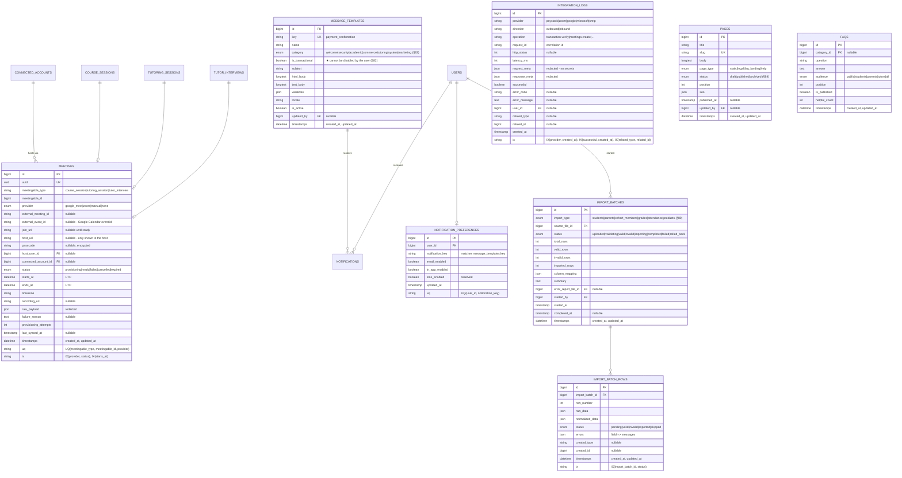

# 03 — Database ERD

**Deliverable:** spec §102.3 — *"A database ERD represented in text/Markdown."*

A single diagram of 124 tables is unreadable, so this document presents:
1. a **context overview** (how the nine bounded contexts connect),
2. one **Mermaid `erDiagram` per bounded context** (renders on GitHub/GitLab/VS Code),
3. an **ASCII relationship map** mirroring spec §67 exactly, table by table,
4. **cardinality and optionality notes** for every non-obvious relationship.

Conventions used throughout:

```
PK   primary key (BIGINT UNSIGNED AUTO_INCREMENT unless noted)
FK   foreign key
UQ   unique constraint
IX   non-unique index
§    the spec section that requires the entity
```

---

## 1. Context overview

```
                                   ┌──────────────────────────┐
                                   │        IDENTITY          │
                                   │  users · connected_accts │
                                   │  roles · permissions     │
                                   │  consents · sessions     │
                                   └────────────┬─────────────┘
                     every profile points at a user (nullable!)
        ┌───────────────────┬───────────────────┼───────────────────┬──────────────────┐
        ▼                   ▼                   ▼                   ▼                  ▼
┌───────────────┐  ┌────────────────┐  ┌────────────────┐  ┌────────────────┐ ┌───────────────┐
│   EDUCATION   │  │      LMS       │  │   ASSESSMENT   │  │    TUTORING    │ │   COMMERCE    │
│ academic_years│  │ courses        │  │ assessments    │  │ tutor_apps     │ │ products      │
│ academic_terms│  │ modules        │  │ questions      │  │ interviews     │ │ orders        │
│ programs      │  │ lessons        │  │ submissions    │  │ evaluations    │ │ payments      │
│ subjects      │  │ enrollments    │  │ grading_schemes│  │ tutor_profiles │ │ invoices      │
│ students      │  │ progress       │  │ results        │  │ availability   │ │ subscriptions │
│ parents       │  │ certificates   │  │ report cards   │  │ services       │ │ entitlements  │
│ applications  │  │ discussions    │  │                │  │ bookings       │ │ downloads     │
│ cohorts       │  │                │  │                │  │ sessions       │ │               │
│ schedules     │  │                │  │                │  │ reviews        │ │               │
│ attendance    │  │                │  │                │  │ earnings       │ │               │
└───────┬───────┘  └───────┬────────┘  └───────┬────────┘  └───────┬────────┘ └───────┬───────┘
        │                  │                   │                   │                  │
        └──────────────────┴───────────────────┴─────────┬─────────┴──────────────────┘
                                                         ▼
                              ┌───────────────────────────────────────────────┐
                              │              INTEGRATION                      │
                              │   meetings (polymorphic) · integration_logs   │
                              │   ← VideoMeetingProvider / PaymentGateway     │
                              └───────────────────────────────────────────────┘
                              ┌───────────────────────────────────────────────┐
                              │   CROSS-CUTTING:  ADMINISTRATION              │
                              │   settings · audit_logs · files · imports     │
                              │   +  COMMUNICATION:  templates · preferences  │
                              │                announcements · pages · faqs   │
                              └───────────────────────────────────────────────┘
```

**The two relationships that hold the whole platform together:**

```
    COMMERCE.entitlements  ──►  LMS.course_enrollments      (grants course access, §19/§45)
    COMMERCE.entitlement_consumptions  ──►  TUTORING.tutoring_sessions   (grants session delivery)

    Commerce never calls Lms or Tutoring. They read the entitlement tables.
```

---

## 2. Identity & platform core

```mermaid
erDiagram
    USERS ||--o| STUDENTS : "may own (nullable user_id)"
    USERS ||--o| PARENTS : "may own"
    USERS ||--o| TUTOR_PROFILES : "may own"
    USERS ||--o{ CONNECTED_ACCOUNTS : "has"
    USERS ||--o{ CONSENTS : "grants"
    USERS ||--o| NOTIFICATION_PREFERENCES : "configures"
    USERS ||--o{ AUDIT_LOGS : "acts in"
    USERS ||--o{ PERSONAL_ACCESS_TOKENS : "issues"
    USERS ||--o{ SESSIONS : "signs in"
    ROLES ||--o{ MODEL_HAS_ROLES : ""
    USERS ||--o{ MODEL_HAS_ROLES : ""
    PERMISSIONS ||--o{ MODEL_HAS_PERMISSIONS : ""
    USERS ||--o{ MODEL_HAS_PERMISSIONS : ""
    ROLES ||--o{ ROLE_HAS_PERMISSIONS : ""
    PERMISSIONS ||--o{ ROLE_HAS_PERMISSIONS : ""

    USERS {
        bigint id PK
        uuid uuid UK
        string name
        string email UK
        string password "nullable when OAuth-only"
        enum status "pending|active|suspended|deactivated"
        string timezone "IANA, default from settings"
        string locale
        string avatar_file_id FK
        boolean two_factor_enabled
        text two_factor_secret "encrypted"
        text two_factor_recovery_codes "encrypted"
        timestamp two_factor_confirmed_at
        timestamp email_verified_at
        string auth_provider "password|google|microsoft"
        string created_by_type "self|admin|oauth|import"
        timestamp last_login_at
        string last_login_ip
        timestamp deleted_at
        datetime timestamps "created_at, updated_at"
    }
    CONNECTED_ACCOUNTS {
        bigint id PK
        bigint user_id FK
        enum provider "google|microsoft|zoom"
        enum purpose "login|meetings|calendar"
        string provider_user_id
        string provider_email
        text access_token "encrypted"
        text refresh_token "encrypted"
        timestamp expires_at
        string scopes
        json meta
        enum status "connected|expired|revoked|error"
        timestamp last_used_at
        datetime timestamps "created_at, updated_at"
        string uq "UQ(user_id, provider, purpose)"
    }
    CONSENTS {
        bigint id PK
        bigint user_id FK
        bigint student_id FK "nullable - consent on behalf of a minor"
        enum type "terms|privacy|marketing|data_processing|photo_release"
        string version
        boolean granted
        string ip_address
        string user_agent
        timestamp recorded_at
    }
    AUDIT_LOGS {
        bigint id PK
        bigint user_id FK "nullable for system actions"
        string event "tutors.approved"
        string auditable_type
        bigint auditable_id
        json old_values "redacted"
        json new_values "redacted"
        string ip_address
        string user_agent
        string tags
        timestamp created_at
        string ix "IX(auditable_type, auditable_id), IX(event), IX(created_at)"
    }
    SETTINGS {
        bigint id PK
        string group "organization|academic|commerce|payments|video|notifications|security"
        string key UK
        json value
        enum type "string|int|bool|decimal|json|enum"
        boolean is_secret
        boolean is_public
        string description
        datetime timestamps "created_at, updated_at"
    }
    FILES {
        bigint id PK
        uuid uuid UK
        string fileable_type "nullable"
        bigint fileable_id "nullable"
        enum category "profile_photo|cv|certification|student_document|course_resource|assignment|digital_product|certificate|invoice|report"
        enum visibility "public|authenticated|private|restricted"
        string disk "local|s3"
        string path
        string original_name
        string mime_type
        bigint size_bytes
        string checksum_sha256
        bigint uploaded_by FK
        json meta
        timestamp deleted_at
        datetime timestamps "created_at, updated_at"
        string ix "IX(fileable_type, fileable_id), IX(category, visibility)"
    }
```



---

## 3. Education context

```mermaid
erDiagram
    ACADEMIC_YEARS ||--o{ ACADEMIC_TERMS : "contains"
    ACADEMIC_YEARS ||--o{ PROGRAM_ENROLLMENTS : "frames"
    ACADEMIC_TERMS ||--o{ PROGRAM_ENROLLMENTS : "frames"
    ACADEMIC_TERMS ||--o{ COHORTS : "frames"
    ACADEMIC_TERMS ||--o{ ASSESSMENTS : "frames"
    ACADEMIC_LEVELS ||--o{ STUDENTS : "classifies"
    ACADEMIC_LEVELS ||--o{ SUBJECTS : "classifies"
    ACADEMIC_LEVELS ||--o{ PROGRAMS : "targets"
    PROGRAMS ||--o{ PROGRAM_COURSES : "learning path"
    COURSES ||--o{ PROGRAM_COURSES : "is in path"
    PROGRAMS ||--o{ PROGRAM_ENROLLMENTS : ""
    STUDENTS ||--o{ PROGRAM_ENROLLMENTS : ""
    SUBJECTS ||--o{ COURSE_SUBJECT : ""
    COURSES ||--o{ COURSE_SUBJECT : ""
    STUDENTS }o--o{ PARENTS : "via parent_student"
    PARENT_STUDENT }o--|| STUDENTS : ""
    PARENT_STUDENT }o--|| PARENTS : ""
    STUDENTS ||--o{ STUDENT_APPLICATIONS : "may originate"
    STUDENT_APPLICATIONS ||--o{ STUDENT_APPLICATION_DOCUMENTS : ""
    STUDENT_APPLICATIONS ||--o{ STUDENT_APPLICATION_EVENTS : "history"
    PROGRAMS ||--o{ STUDENT_APPLICATIONS : "applied to"
    COHORTS ||--o{ COHORT_STUDENT : ""
    STUDENTS ||--o{ COHORT_STUDENT : ""
    COHORTS ||--o{ COURSE_SCHEDULES : "recurring pattern"
    COURSE_SCHEDULES ||--o{ COURSE_SESSIONS : "materializes"
    COHORTS ||--o{ COURSE_SESSIONS : ""
    COURSE_SESSIONS ||--o{ ATTENDANCE_RECORDS : ""
    STUDENTS ||--o{ ATTENDANCE_RECORDS : ""
    TUTOR_PROFILES ||--o{ COHORTS : "instructs"
    ANNOUNCEMENTS ||--o{ ANNOUNCEMENT_TARGETS : "addressed to"

    ACADEMIC_YEARS {
        bigint id PK
        string name UK "2026/2027"
        date starts_at
        date ends_at
        enum status "draft|active|closed|archived"
        text description
        boolean is_active "one active year enforced in service layer"
        datetime timestamps "created_at, updated_at"
    }
    ACADEMIC_TERMS {
        bigint id PK
        bigint academic_year_id FK
        string name "First Term"
        string code UK "per year"
        date starts_at
        date ends_at
        enum status "draft|active|closed"
        int position
        datetime timestamps "created_at, updated_at"
    }
    ACADEMIC_LEVELS {
        bigint id PK
        string name UK "Primary 5"
        string code UK
        int position
        enum band "early_years|primary|junior_secondary|senior_secondary|tertiary|adult"
        int typical_age_min
        int typical_age_max
        boolean is_active
        datetime timestamps "created_at, updated_at"
    }
    PROGRAMS {
        bigint id PK
        string name
        string code UK
        text description
        bigint academic_level_id FK
        int duration_terms "nullable"
        enum status "draft|active|suspended|archived"
        int target_age_min
        int target_age_max
        json learning_outcomes
        string thumbnail_file_id FK
        datetime timestamps "created_at, updated_at"
        string ft "FULLTEXT(name, description)"
    }
    PROGRAM_COURSES {
        bigint id PK
        bigint program_id FK
        bigint course_id FK
        int position
        boolean is_required
        bigint prerequisite_program_course_id FK "nullable, self-ref"
        string uq "UQ(program_id, course_id)"
    }
    SUBJECTS {
        bigint id PK
        string name
        string code UK
        text description
        bigint academic_level_id FK "nullable"
        enum status "draft|active|archived"
        datetime timestamps "created_at, updated_at"
    }
    STUDENTS {
        bigint id PK
        string student_code UK "STU-2026-00001"
        bigint user_id FK "nullable + UQ"
        string first_name
        string middle_name
        string last_name
        date date_of_birth "nullable - null is treated as MINOR"
        enum gender "male|female|other|undisclosed"
        string email "nullable for young students"
        string phone
        text address_line
        string city
        string state
        string country "ISO-3166 alpha-2, default NG"
        string postal_code
        bigint academic_level_id FK
        bigint program_id FK "nullable - current program"
        bigint academic_year_id FK "nullable"
        enum status "applicant|active|inactive|graduated|suspended|withdrawn"
        string timezone
        string avatar_file_id FK
        string emergency_contact_name
        string emergency_contact_phone
        text notes "restricted visibility"
        json meta
        date enrolled_on
        bigint created_by FK
        timestamp deleted_at
        datetime timestamps "created_at, updated_at"
        string ix "IX(status), IX(academic_year_id, status), FULLTEXT(names)"
    }
    PARENTS {
        bigint id PK
        bigint user_id FK "nullable + UQ"
        string first_name
        string last_name
        string email "UQ when user_id null - used to claim"
        string phone
        text address_line
        string city
        string state
        string country
        string occupation
        enum status "invited|active|inactive|blocked"
        string invite_token "hashed, nullable"
        timestamp invited_at
        json billing_info "name, address, tax id - encrypted fields where needed"
        boolean marketing_opt_in "default FALSE (§83)"
        text notes
        bigint created_by FK
        timestamp deleted_at
        datetime timestamps "created_at, updated_at"
    }
    PARENT_STUDENT {
        bigint id PK
        bigint parent_id FK
        bigint student_id FK
        enum relationship "father|mother|guardian|grandparent|sibling|other"
        string relationship_other
        boolean is_primary
        boolean can_purchase "★ the §10 authorization flag"
        boolean can_view_academics
        boolean can_view_financials
        boolean can_receive_communications
        boolean can_pickup_or_authorize
        enum status "pending|active|revoked"
        date effective_from
        date effective_to "nullable"
        string consent_version
        timestamp consent_recorded_at
        bigint linked_by FK
        timestamp linked_at
        text revocation_reason
        string uq "UQ(parent_id, student_id)"
        string ix "IX(student_id, status), IX(parent_id, status)"
    }
    STUDENT_APPLICATIONS {
        bigint id PK
        string reference UK "APP-2026-0001"
        bigint student_id FK "nullable until conversion"
        bigint program_id FK
        bigint academic_level_id FK
        bigint academic_year_id FK
        bigint academic_term_id FK "nullable"
        string applicant_first_name
        string applicant_last_name
        date applicant_date_of_birth
        enum applicant_gender
        string applicant_email
        text guardian_name
        string guardian_email
        string guardian_phone
        enum guardian_relationship
        enum status "draft|submitted|under_review|accepted|rejected|waitlisted|enrolled|withdrawn"
        bigint assigned_reviewer_id FK "nullable"
        text statement
        json supporting_data
        text review_notes
        timestamp reviewed_at
        bigint reviewed_by FK "nullable"
        text rejection_reason
        timestamp submitted_at
        bigint created_by FK "nullable = self-service"
        datetime timestamps "created_at, updated_at"
        string ix "IX(status, submitted_at), IX(program_id, status)"
    }
    PROGRAM_ENROLLMENTS {
        bigint id PK
        bigint student_id FK
        bigint program_id FK
        bigint academic_year_id FK
        bigint academic_term_id FK "nullable"
        date starts_at
        date ends_at "nullable"
        enum status "active|completed|suspended|withdrawn"
        enum enrollment_source "manual|application|purchase|parent_purchase|admin|import|entitlement"
        bigint entitlement_id FK "nullable (§12 payment/entitlement reference)"
        bigint enrolled_by FK
        text notes
        timestamp completed_at
        datetime timestamps "created_at, updated_at"
        string uq "UQ(student_id, program_id, academic_year_id, academic_term_id)"
    }
    COHORTS {
        bigint id PK
        string name "Primary 5 Mathematics - September 2026"
        string code UK
        bigint academic_year_id FK
        bigint academic_term_id FK "nullable"
        bigint program_id FK "nullable"
        bigint course_id FK "nullable"
        bigint subject_id FK "nullable"
        bigint instructor_id FK "tutor_profiles.id, nullable"
        int capacity "nullable"
        date starts_at
        date ends_at
        string timezone
        enum status "draft|open|in_progress|completed|cancelled|archived"
        text description
        datetime timestamps "created_at, updated_at"
        string ix "IX(academic_year_id, status), IX(instructor_id)"
    }
    COHORT_STUDENT {
        bigint id PK
        bigint cohort_id FK
        bigint student_id FK
        enum status "active|completed|withdrawn|removed"
        timestamp joined_at
        timestamp left_at "nullable"
        bigint enrolled_by FK
        string uq "UQ(cohort_id, student_id)"
    }
    COURSE_SCHEDULES {
        bigint id PK
        bigint cohort_id FK
        bigint course_id FK "nullable - defaults to cohort course"
        bigint instructor_id FK "nullable - defaults to cohort instructor"
        tinyint weekday "0=Sunday .. 6=Saturday"
        time starts_at_local "wall clock (§62)"
        time ends_at_local
        string timezone "IANA"
        date valid_from
        date valid_until "nullable"
        enum meeting_provider "google_meet|zoom|manual|none"
        boolean auto_generate_sessions
        int buffer_minutes
        enum status "active|paused|archived"
        datetime timestamps "created_at, updated_at"
    }
    COURSE_SESSIONS {
        bigint id PK
        bigint cohort_id FK
        bigint course_schedule_id FK "nullable"
        bigint course_id FK
        bigint instructor_id FK "nullable"
        datetime starts_at "UTC"
        datetime ends_at "UTC"
        string starts_at_local
        string ends_at_local
        string timezone
        enum status "scheduled|confirmed|in_progress|completed|cancelled|no_show"
        text agenda
        text summary
        bigint meeting_id FK "nullable"
        string recording_url
        boolean is_makeup
        bigint cancelled_by FK "nullable"
        text cancellation_reason
        datetime timestamps "created_at, updated_at"
        string ix "IX(starts_at), IX(cohort_id, starts_at), IX(instructor_id, starts_at)"
    }
    ATTENDANCE_RECORDS {
        bigint id PK
        string session_type "course_session|tutoring_session"
        bigint session_id
        bigint student_id FK
        enum status "present|absent|late|excused"
        datetime checked_in_at "nullable, UTC"
        datetime checked_out_at "nullable, UTC"
        text notes
        bigint recorded_by FK
        string excused_reason
        bigint excused_document_file_id FK "nullable"
        datetime timestamps "created_at, updated_at"
        string uq "UQ(session_type, session_id, student_id)"
        string ix "IX(student_id, created_at)"
    }
    NON_WORKING_DATES {
        bigint id PK
        date on_date
        string name "Public Holiday"
        enum scope "institution|cohort|tutor"
        bigint scope_id "nullable"
        boolean suppress_sessions
        boolean suppress_tutoring_slots
        datetime timestamps "created_at, updated_at"
    }
    ANNOUNCEMENTS {
        bigint id PK
        string title
        text body
        bigint author_id FK
        enum audience_type "all|students|parents|tutors|cohort|course|program|custom"
        timestamp publish_at
        timestamp expires_at "nullable"
        boolean is_pinned
        enum status "draft|published|archived"
        enum priority "normal|important|urgent"
        datetime timestamps "created_at, updated_at"
    }
    ANNOUNCEMENT_TARGETS {
        bigint id PK
        bigint announcement_id FK
        string target_type "cohort|course|program|student|user"
        bigint target_id
        string uq "UQ(announcement_id, target_type, target_id)"
    }
```



---

## 4. LMS context

```mermaid
erDiagram
    COURSES ||--o{ COURSE_MODULES : "ordered"
    COURSE_MODULES ||--o{ LESSONS : "ordered"
    LESSONS ||--o{ LESSON_TOPICS : "ordered"
    LESSONS ||--o{ LESSON_RESOURCES : "has"
    LESSONS ||--o{ ASSESSMENTS : "may host"
    COURSES ||--o{ COURSE_ENROLLMENTS : ""
    STUDENTS ||--o{ COURSE_ENROLLMENTS : ""
    ENTITLEMENTS ||--o{ COURSE_ENROLLMENTS : "may be the source"
    COURSE_ENROLLMENTS ||--o| COURSE_PROGRESS : "rollup"
    STUDENTS ||--o{ LESSON_PROGRESS : ""
    LESSONS ||--o{ LESSON_PROGRESS : ""
    STUDENTS ||--o{ LEARNING_ACTIVITIES : ""
    COURSES ||--o{ DISCUSSIONS : ""
    DISCUSSIONS ||--o{ DISCUSSION_POSTS : ""
    CERTIFICATE_TEMPLATES ||--o{ CERTIFICATES : "renders"
    STUDENTS ||--o{ CERTIFICATES : "awarded"
    COURSES ||--o{ CERTIFICATES : "for"
    PROGRAMS ||--o{ CERTIFICATES : "for"

    COURSES {
        bigint id PK
        string slug UK
        string title
        string short_description
        text description
        bigint academic_level_id FK "nullable"
        bigint subject_id FK "nullable"
        text prerequisites
        enum status "draft|review|published|unpublished|archived (§85)"
        string thumbnail_file_id FK
        string trailer_video_url
        int estimated_hours
        enum completion_rule "all_lessons|percent|assessments_passed|manual"
        int completion_percent_required
        boolean issues_certificate
        bigint certificate_template_id FK "nullable"
        boolean is_free_preview_enabled
        timestamp published_at
        bigint published_by FK "nullable"
        bigint author_id FK
        json seo
        timestamp deleted_at
        datetime timestamps "created_at, updated_at"
        string ft "FULLTEXT(title, description)"
    }
    COURSE_MODULES {
        bigint id PK
        bigint course_id FK
        string title
        text description
        int position
        boolean is_published
        timestamp available_from "nullable (drip)"
        datetime timestamps "created_at, updated_at"
        string uq "UQ(course_id, position)"
    }
    LESSONS {
        bigint id PK
        bigint course_module_id FK
        string title
        string slug
        enum type "text|video|audio|document|embed|external|quiz|assignment"
        longtext body "sanitized rich text"
        string video_url
        string video_provider "youtube|vimeo|self_hosted|none"
        string audio_url
        string external_url
        string embed_code "sanitized"
        bigint primary_file_id FK "nullable"
        bigint assessment_id FK "nullable - when type is quiz/assignment"
        int position
        int estimated_minutes
        boolean is_free_preview
        boolean requires_completion_of_previous
        enum status "draft|published"
        datetime timestamps "created_at, updated_at"
        string uq "UQ(course_module_id, position)"
    }
    LESSON_TOPICS {
        bigint id PK
        bigint lesson_id FK
        string title
        longtext body
        int position
        datetime timestamps "created_at, updated_at"
    }
    LESSON_RESOURCES {
        bigint id PK
        bigint lesson_id FK
        bigint file_id FK
        string title
        enum kind "download|reference|video|audio|document|link"
        string url "nullable"
        boolean is_downloadable
        int position
        datetime timestamps "created_at, updated_at"
    }
    COURSE_ENROLLMENTS {
        bigint id PK
        bigint student_id FK
        bigint course_id FK
        bigint cohort_id FK "nullable"
        enum source "manual|program|purchase|parent_purchase|admin|tutoring|entitlement|import"
        bigint entitlement_id FK "nullable (§19)"
        enum status "active|completed|suspended|expired|withdrawn"
        timestamp enrolled_at
        timestamp completed_at "nullable"
        bigint enrolled_by FK "nullable"
        datetime timestamps "created_at, updated_at"
        string uq "UQ(student_id, course_id, cohort_id)"
        string ix "IX(course_id, status), IX(student_id, status)"
    }
    COURSE_PROGRESS {
        bigint id PK
        bigint course_enrollment_id FK "UQ"
        bigint student_id FK
        bigint course_id FK
        decimal percent_complete "5,2"
        int lessons_completed
        int lessons_total
        int modules_completed
        int modules_total
        bigint seconds_spent
        timestamp last_activity_at
        timestamp completed_at "nullable"
        datetime timestamps "created_at, updated_at"
        string ix "IX(student_id, last_activity_at)"
    }
    LESSON_PROGRESS {
        bigint id PK
        bigint student_id FK
        bigint lesson_id FK
        bigint course_enrollment_id FK
        enum status "not_started|in_progress|completed"
        timestamp first_accessed_at
        timestamp last_accessed_at
        bigint seconds_spent
        int attempts
        timestamp completed_at "nullable"
        datetime timestamps "created_at, updated_at"
        string uq "UQ(student_id, lesson_id)"
    }
    LEARNING_ACTIVITIES {
        bigint id PK
        bigint student_id FK
        string activity_type "lesson_viewed|lesson_completed|quiz_attempted|assignment_submitted|resource_downloaded|discussion_posted|session_attended"
        string subject_type "nullable"
        bigint subject_id "nullable"
        bigint course_id FK "nullable"
        json meta
        timestamp occurred_at
        string ix "IX(student_id, occurred_at), IX(course_id, activity_type)"
    }
    DISCUSSIONS {
        bigint id PK
        string discussion_type "course|lesson|cohort"
        bigint discussion_scope_id
        string title
        text body
        bigint author_type "student|tutor|admin"
        bigint author_id
        boolean is_pinned
        boolean is_locked
        enum status "open|closed|hidden"
        int posts_count
        datetime timestamps "created_at, updated_at"
    }
    DISCUSSION_POSTS {
        bigint id PK
        bigint discussion_id FK
        bigint parent_post_id FK "nullable - threaded"
        text body
        string author_type
        bigint author_id
        boolean is_answer
        enum status "visible|hidden|reported"
        datetime timestamps "created_at, updated_at"
    }
    CERTIFICATE_TEMPLATES {
        bigint id PK
        string name
        enum orientation "landscape|portrait"
        string background_file_id FK "nullable"
        string seal_file_id FK "nullable"
        string signature_file_id FK "nullable"
        string signatory_name
        string signatory_title
        text body_template "blade-ish with {{student_name}} tokens"
        string number_prefix "CERT-"
        boolean is_active
        datetime timestamps "created_at, updated_at"
    }
    CERTIFICATES {
        bigint id PK
        string number UK "CERT-2026-000123"
        string verification_code UK "unguessable, 32 chars"
        bigint student_id FK
        string awardable_type "course|program|cohort"
        bigint awardable_id
        bigint certificate_template_id FK
        string title "Human-readable award title"
        text citation
        date completion_date
        timestamp issued_at
        bigint issued_by FK
        enum status "issued|revoked"
        timestamp revoked_at "nullable"
        text revocation_reason
        bigint file_id FK "rendered PDF"
        string qr_payload
        datetime timestamps "created_at, updated_at"
        string ix "IX(student_id), IX(awardable_type, awardable_id)"
    }
```



---

## 5. Assessment context

```mermaid
erDiagram
    COURSES ||--o{ ASSESSMENTS : ""
    COHORTS ||--o{ ASSESSMENTS : ""
    ACADEMIC_TERMS ||--o{ ASSESSMENTS : ""
    GRADING_SCHEMES ||--o{ GRADING_SCALE_BANDS : ""
    GRADING_SCHEMES ||--o{ ASSESSMENTS : ""
    ASSESSMENTS ||--o| QUIZ_SETTINGS : "1:1 when type=quiz"
    ASSESSMENTS ||--o| ASSIGNMENT_DETAILS : "1:1 when type=assignment"
    ASSESSMENTS ||--o{ ASSESSMENT_QUESTIONS : ""
    QUESTIONS ||--o{ ASSESSMENT_QUESTIONS : ""
    QUESTIONS ||--o{ QUESTION_OPTIONS : ""
    ASSESSMENTS ||--o{ ASSESSMENT_SUBMISSIONS : ""
    STUDENTS ||--o{ ASSESSMENT_SUBMISSIONS : ""
    ASSESSMENT_SUBMISSIONS ||--o{ SUBMISSION_ANSWERS : ""
    STUDENTS ||--o{ ACADEMIC_RESULTS : ""
    ACADEMIC_TERMS ||--o{ ACADEMIC_RESULTS : ""
    SUBJECTS ||--o{ ACADEMIC_RESULTS : ""
    STUDENTS ||--o{ ACADEMIC_REPORTS : ""

    ASSESSMENTS {
        bigint id PK
        string title
        text description
        enum type "quiz|assignment|examination|project|continuous|tutor_assessment (§23)"
        bigint course_id FK "nullable"
        bigint course_module_id FK "nullable"
        bigint lesson_id FK "nullable"
        bigint cohort_id FK "nullable"
        bigint subject_id FK "nullable"
        bigint academic_year_id FK
        bigint academic_term_id FK "nullable"
        decimal max_score "8,2"
        decimal weight "5,2 - contribution to the gradebook"
        decimal passing_score "8,2"
        bigint grading_scheme_id FK "nullable"
        int attempts_allowed "0 = unlimited"
        timestamp publish_at
        timestamp due_at
        timestamp close_at "nullable"
        enum late_policy "reject|accept_with_penalty|accept"
        decimal late_penalty_percent
        enum scope "cohort|individual|course"
        bigint assigned_to_student_id FK "nullable when scope=individual"
        bigint assessor_id FK "tutor_profiles.id or users.id"
        enum status "draft|scheduled|open|closed|graded|published"
        boolean results_visible_to_students
        boolean results_visible_to_parents
        bigint created_by FK
        datetime timestamps "created_at, updated_at"
        string ix "IX(status, due_at), IX(course_id, status), IX(cohort_id)"
    }
    QUIZ_SETTINGS {
        bigint id PK
        bigint assessment_id PK "1:1, also FK"
        int duration_minutes "nullable = untimed"
        boolean shuffle_questions
        boolean shuffle_options
        enum show_results "immediately|after_close|after_grading|never"
        boolean show_correct_answers
        boolean allow_back_navigation
        boolean require_all_answered
        int pass_percentage
        datetime timestamps "created_at, updated_at"
    }
    ASSIGNMENT_DETAILS {
        bigint id PK
        bigint assessment_id PK "1:1, also FK"
        longtext instructions
        boolean allows_file_upload
        boolean allows_text_submission
        int max_files
        bigint max_file_size_kb
        string accepted_mime_types
        boolean allows_resubmission
        int max_submissions
        timestamp resubmission_deadline "nullable"
        boolean requires_plagiarism_acknowledgement
        datetime timestamps "created_at, updated_at"
    }
    QUESTIONS {
        bigint id PK
        string question_code UK "nullable"
        enum type "multiple_choice|multiple_select|true_false|short_answer|long_answer|matching (§21)"
        longtext stem
        longtext explanation
        text correct_answer "for short/long answer reference"
        decimal default_points "6,2"
        enum difficulty "easy|medium|hard"
        bigint subject_id FK "nullable"
        bigint course_id FK "nullable"
        json tags
        boolean is_active
        bigint created_by FK
        datetime timestamps "created_at, updated_at"
        string ft "FULLTEXT(stem)"
    }
    QUESTION_OPTIONS {
        bigint id PK
        bigint question_id FK
        string option_key "A|B|C|D or match-pair id"
        text body
        boolean is_correct
        decimal weight "6,2 - partial credit"
        int position
        string matched_to "for matching questions"
        datetime timestamps "created_at, updated_at"
    }
    ASSESSMENT_QUESTIONS {
        bigint id PK
        bigint assessment_id FK
        bigint question_id FK
        int position
        decimal points "6,2 - overrides question default"
        boolean is_required
        string uq "UQ(assessment_id, question_id)"
    }
    ASSESSMENT_SUBMISSIONS {
        bigint id PK
        bigint assessment_id FK
        bigint student_id FK
        int version "1-based; supports resubmission (§22)"
        boolean is_current
        enum status "not_started|in_progress|submitted|late|graded|returned (§22)"
        timestamp started_at
        timestamp submitted_at "nullable"
        datetime due_at_snapshot "UTC"
        decimal score "8,2 nullable"
        decimal max_score "8,2"
        decimal percentage "5,2 nullable"
        string grade_letter "nullable"
        decimal grade_point "4,2 nullable"
        bigint grading_band_id FK "nullable"
        text feedback
        bigint graded_by FK "nullable"
        timestamp graded_at "nullable"
        text marker_notes
        bigint seconds_spent
        string ip_address
        json question_snapshot "ordered question ids + option order (§21 randomization audit)"
        boolean is_auto_graded
        datetime timestamps "created_at, updated_at"
        string uq "UQ(assessment_id, student_id, version)"
        string ix "IX(student_id, status), IX(assessment_id, is_current)"
    }
    SUBMISSION_ANSWERS {
        bigint id PK
        bigint submission_id FK
        bigint question_id FK
        json given_answer "option ids | text | pairs"
        boolean is_correct "nullable for manual marking"
        decimal awarded_score "6,2 nullable"
        decimal max_score "6,2"
        text marker_comment
        bigint marked_by FK "nullable"
        timestamp marked_at "nullable"
        int time_spent_seconds
        datetime timestamps "created_at, updated_at"
        string uq "UQ(submission_id, question_id)"
    }
    GRADING_SCHEMES {
        bigint id PK
        string name UK "Nigerian 5-point"
        enum basis "percentage|score"
        enum scope "global|program|level|course"
        bigint scope_id "nullable"
        boolean is_default
        boolean is_active
        text description
        datetime timestamps "created_at, updated_at"
    }
    GRADING_SCALE_BANDS {
        bigint id PK
        bigint grading_scheme_id FK
        string grade_letter "A"
        string grade_label "Excellent"
        decimal min_percentage "5,2"
        decimal max_percentage "5,2"
        decimal min_score "8,2 nullable"
        decimal max_score "8,2 nullable"
        decimal gpa_point "4,2 nullable"
        string remark
        int position
        datetime timestamps "created_at, updated_at"
        string ix "IX(grading_scheme_id, position)"
    }
    ACADEMIC_RESULTS {
        bigint id PK
        bigint student_id FK
        bigint academic_year_id FK
        bigint academic_term_id FK
        bigint program_id FK "nullable"
        bigint subject_id FK "nullable"
        bigint course_id FK "nullable"
        bigint cohort_id FK "nullable"
        decimal total_weighted_score "8,2"
        decimal max_possible_score "8,2"
        decimal percentage "5,2"
        string grade_letter
        decimal grade_point "4,2 nullable"
        bigint grading_scheme_id FK
        bigint grading_band_id FK
        text remark
        enum status "provisional|published|amended"
        int position_in_cohort "nullable (§25)"
        boolean is_completed
        timestamp published_at "nullable"
        bigint computed_by FK "nullable = system"
        datetime timestamps "created_at, updated_at"
        string uq "UQ(student_id, academic_term_id, course_id, subject_id)"
        string ix "IX(academic_term_id, course_id), IX(student_id, academic_year_id)"
    }
    ACADEMIC_REPORTS {
        bigint id PK
        bigint student_id FK
        bigint academic_year_id FK
        bigint academic_term_id FK
        enum report_type "term_report|annual_transcript|progress_report"
        bigint file_id FK "rendered PDF"
        timestamp generated_at
        bigint generated_by FK "nullable = system"
        boolean shared_with_parent
        datetime timestamps "created_at, updated_at"
        string uq "UQ(student_id, academic_term_id, report_type)"
    }
```



---

## 6. Tutoring & recruitment context

```mermaid
erDiagram
    USERS ||--o| TUTOR_APPLICATIONS : "submits"
    TUTOR_APPLICATIONS ||--o{ TUTOR_APPLICATION_DOCUMENTS : ""
    TUTOR_APPLICATIONS ||--o{ TUTOR_APPLICATION_EVENTS : "history"
    TUTOR_APPLICATIONS ||--o{ TUTOR_QUALIFICATIONS : ""
    TUTOR_APPLICATIONS ||--o{ TUTOR_WORK_EXPERIENCES : ""
    TUTOR_APPLICATIONS ||--o{ TUTOR_REFERENCES : ""
    TUTOR_APPLICATIONS ||--o{ TUTOR_APPLICATION_SUBJECTS : ""
    SUBJECTS ||--o{ TUTOR_APPLICATION_SUBJECTS : ""
    TUTOR_APPLICATIONS ||--o{ TUTOR_INTERVIEWS : ""
    TUTOR_APPLICATIONS ||--o{ TUTOR_EVALUATIONS : ""
    EVALUATION_FORMS ||--o{ EVALUATION_FORM_CRITERIA : ""
    EVALUATION_CRITERIA ||--o{ EVALUATION_FORM_CRITERIA : ""
    EVALUATION_FORMS ||--o{ TUTOR_EVALUATIONS : ""
    TUTOR_EVALUATIONS ||--o{ EVALUATION_CRITERION_SCORES : ""
    TUTOR_INTERVIEWS ||--o{ TUTOR_EVALUATIONS : ""
    TUTOR_APPLICATIONS ||--o| TUTOR_PROFILES : "on approval (§30)"
    TUTOR_PROFILES ||--o{ TUTOR_SUBJECTS : ""
    TUTOR_PROFILES ||--o{ TUTOR_AVAILABILITIES : ""
    TUTOR_PROFILES ||--o{ TUTOR_UNAVAILABLE_DATES : ""
    TUTOR_PROFILES ||--o{ TUTORING_SERVICES : ""
    TUTORING_SERVICES ||--o{ TUTORING_SERVICE_TUTORS : "pool"
    TUTORING_SERVICES ||--o{ TUTORING_PACKAGES : ""
    TUTORING_SERVICES ||--o{ TUTORING_BOOKINGS : ""
    TUTORING_PACKAGES ||--o{ TUTORING_BOOKINGS : ""
    TUTORING_BOOKINGS ||--o{ TUTORING_SESSIONS : ""
    TUTORING_SESSIONS ||--o{ SESSION_NOTES : ""
    TUTORING_SESSIONS ||--o{ TUTOR_REVIEWS : ""
    TUTORING_SESSIONS ||--o{ TUTOR_EARNINGS : ""
    TUTORING_SESSIONS ||--o| MEETINGS : ""
    TUTOR_INTERVIEWS ||--o| MEETINGS : ""
    STUDENTS ||--o{ TUTORING_BOOKINGS : "beneficiary"
    PARENTS ||--o{ TUTORING_BOOKINGS : "purchaser"
    ENTITLEMENTS ||--o{ ENTITLEMENT_CONSUMPTIONS : ""
    TUTORING_SESSIONS ||--o{ ENTITLEMENT_CONSUMPTIONS : ""

    TUTOR_APPLICATIONS {
        bigint id PK
        string reference UK "TA-2026-0001"
        bigint user_id FK "nullable until account creation"
        string first_name
        string last_name
        string email
        string phone
        date date_of_birth
        text address_line
        string city
        string state
        string country
        string timezone
        text bio
        longtext teaching_philosophy
        int years_experience
        enum highest_education "none|secondary|diploma|bachelors|masters|phd|professional"
        string institution
        string field_of_study
        string languages "json array"
        json teaching_methods
        json availability_preference
        decimal expected_hourly_rate "12,2 nullable"
        string expected_currency "char(3)"
        enum status "draft|submitted|under_review|shortlisted|interview_scheduled|interview_completed|approved|rejected|withdrawn (§27)"
        bigint assigned_evaluator_id FK "nullable"
        text admin_notes
        timestamp submitted_at
        timestamp decided_at "nullable"
        bigint decided_by FK "nullable"
        text decision_reason
        string rejection_reason
        timestamp deleted_at
        datetime timestamps "created_at, updated_at"
        string ix "IX(status, submitted_at), IX(assigned_evaluator_id, status)"
    }
    TUTOR_APPLICATION_DOCUMENTS {
        bigint id PK
        bigint tutor_application_id FK
        bigint file_id FK
        enum document_type "cv|certificate|degree|id_document|teaching_license|portfolio|other"
        string label
        boolean is_verified
        bigint verified_by FK "nullable"
        datetime timestamps "created_at, updated_at"
    }
    TUTOR_APPLICATION_EVENTS {
        bigint id PK
        bigint tutor_application_id FK
        enum from_status
        enum to_status
        bigint actor_id FK
        text reason
        json meta
        timestamp created_at
        string ix "IX(tutor_application_id, created_at)"
    }
    TUTOR_QUALIFICATIONS {
        bigint id PK
        string owner_type "tutor_application|tutor_profile"
        bigint owner_id
        enum kind "degree|certification|license|course|award"
        string title
        string issuing_body
        date awarded_on
        date expires_on "nullable"
        string credential_id
        string credential_url
        bigint file_id FK "nullable"
        boolean is_verified
        datetime timestamps "created_at, updated_at"
    }
    TUTOR_WORK_EXPERIENCES {
        bigint id PK
        string owner_type
        bigint owner_id
        string organization
        string role
        date started_on
        date ended_on "nullable"
        boolean is_current
        text description
        boolean is_teaching_role
        datetime timestamps "created_at, updated_at"
    }
    TUTOR_REFERENCES {
        bigint id PK
        string owner_type
        bigint owner_id
        string name
        string relationship
        string email
        string phone
        text notes
        enum contact_status "not_contacted|contacted|responded"
        datetime timestamps "created_at, updated_at"
    }
    TUTOR_APPLICATION_SUBJECTS {
        bigint id PK
        bigint tutor_application_id FK
        bigint subject_id FK
        bigint academic_level_id FK "nullable"
        int proficiency "1-5"
        string uq "UQ(tutor_application_id, subject_id, academic_level_id)"
    }
    EVALUATION_CRITERIA {
        bigint id PK
        string name "Subject mastery"
        text description
        enum score_type "numeric|scale|boolean"
        decimal min_score "5,2"
        decimal max_score "5,2"
        boolean is_active
        datetime timestamps "created_at, updated_at"
    }
    EVALUATION_FORMS {
        bigint id PK
        string name UK
        int version
        text instructions
        boolean is_active
        boolean requires_recommendation
        decimal minimum_total_score "nullable"
        datetime timestamps "created_at, updated_at"
    }
    EVALUATION_FORM_CRITERIA {
        bigint id PK
        bigint evaluation_form_id FK
        bigint evaluation_criterion_id FK
        decimal weight "5,2"
        int position
        boolean is_required
        string uq "UQ(evaluation_form_id, evaluation_criterion_id)"
    }
    TUTOR_INTERVIEWS {
        bigint id PK
        bigint tutor_application_id FK
        bigint primary_evaluator_id FK
        datetime scheduled_starts_at "UTC"
        datetime scheduled_ends_at "UTC"
        string timezone
        string starts_at_local
        enum status "scheduled|in_progress|completed|cancelled|no_show (§29)"
        bigint meeting_id FK "nullable"
        text notes
        decimal score "6,2 nullable"
        enum recommendation "approve|reject|further_review|nullable"
        text recommendation_notes
        timestamp completed_at "nullable"
        bigint cancelled_by FK "nullable"
        text cancellation_reason
        json additional_evaluator_ids
        datetime timestamps "created_at, updated_at"
        string ix "IX(primary_evaluator_id, scheduled_starts_at), IX(status, scheduled_starts_at)"
    }
    TUTOR_EVALUATIONS {
        bigint id PK
        bigint tutor_application_id FK
        bigint tutor_interview_id FK "nullable"
        bigint evaluator_id FK
        bigint evaluation_form_id FK
        int evaluation_form_version
        decimal total_score "6,2"
        decimal max_total_score "6,2"
        decimal weighted_percentage "5,2"
        text strengths
        text weaknesses
        text comments
        enum recommendation "approve|reject|further_review"
        text recommendation_rationale
        timestamp submitted_at
        boolean is_final
        string uq "UQ(tutor_application_id, evaluator_id, tutor_interview_id)"
        string ix "IX(evaluator_id, submitted_at)"
    }
    EVALUATION_CRITERION_SCORES {
        bigint id PK
        bigint tutor_evaluation_id FK
        bigint evaluation_criterion_id FK
        decimal score "6,2"
        decimal max_score "6,2"
        text comment
        datetime timestamps "created_at, updated_at"
        string uq "UQ(tutor_evaluation_id, evaluation_criterion_id)"
    }
    TUTOR_PROFILES {
        bigint id PK
        bigint user_id FK "UQ"
        bigint tutor_application_id FK "nullable + UQ"
        string slug UK
        string display_name
        text headline
        longtext bio
        string avatar_file_id FK
        string cover_file_id FK
        json qualifications_summary
        int years_experience
        json languages
        text teaching_methodology
        string timezone
        decimal base_hourly_rate "12,2"
        string currency "char(3)"
        decimal rating_average "3,2"
        int rating_count
        boolean is_publicly_listed "§87"
        boolean accepts_new_students
        enum status "active|suspended|withdrawn|inactive (§30)"
        timestamp approved_at
        bigint approved_by FK
        int buffer_before_minutes
        int buffer_after_minutes
        int min_notice_hours
        int max_advance_days
        json platform_settings "commission tier etc."
        timestamp deleted_at
        datetime timestamps "created_at, updated_at"
        string ix "IX(status, is_publicly_listed), FULLTEXT(display_name, bio)"
    }
    TUTOR_SUBJECTS {
        bigint id PK
        bigint tutor_profile_id FK
        bigint subject_id FK
        bigint academic_level_id FK "nullable"
        int proficiency "1-5"
        boolean is_primary
        string uq "UQ(tutor_profile_id, subject_id, academic_level_id)"
    }
    TUTOR_AVAILABILITIES {
        bigint id PK
        bigint tutor_profile_id FK
        tinyint weekday "0-6"
        time starts_at_local "wall clock"
        time ends_at_local
        string timezone
        enum recurrence "weekly|once"
        date valid_from
        date valid_until "nullable"
        bigint tutoring_service_id FK "nullable - service-specific"
        int slot_duration_minutes "nullable - defaults to service duration"
        boolean is_active
        datetime timestamps "created_at, updated_at"
        string ix "IX(tutor_profile_id, weekday, is_active)"
    }
    TUTOR_UNAVAILABLE_DATES {
        bigint id PK
        bigint tutor_profile_id FK
        date on_date "or range"
        datetime starts_at "nullable UTC"
        datetime ends_at "nullable UTC"
        enum reason "holiday|leave|existing_commitment|other"
        text note
        datetime timestamps "created_at, updated_at"
        string ix "IX(tutor_profile_id, on_date)"
    }
    TUTORING_SERVICES {
        bigint id PK
        string name "Mathematics 1-on-1 Tutoring"
        string slug UK
        text description
        bigint subject_id FK
        bigint academic_level_id FK "nullable"
        int duration_minutes
        enum delivery_mode "one_on_one|small_group"
        int max_group_size
        bigint assigned_tutor_id FK "nullable - specific tutor"
        enum tutor_assignment "specific|pool|any_available"
        decimal price "12,2"
        string currency "char(3)"
        bigint product_id FK "nullable - the sellable catalog entry"
        boolean requires_parent_purchase "★ §10"
        int min_notice_hours
        int max_advance_days
        int cancellation_window_hours
        enum cancellation_policy "full_refund|partial_refund|no_refund|credit"
        decimal cancellation_fee_percent
        boolean allows_rescheduling
        int reschedule_limit
        enum status "draft|active|paused|archived"
        boolean is_subscription_eligible
        enum billing_interval "one_off|weekly|monthly|termly"
        datetime timestamps "created_at, updated_at"
        string ix "IX(subject_id, status), IX(assigned_tutor_id)"
    }
    TUTORING_SERVICE_TUTORS {
        bigint id PK
        bigint tutoring_service_id FK
        bigint tutor_profile_id FK
        boolean is_active
        int priority
        string uq "UQ(tutoring_service_id, tutor_profile_id)"
    }
    TUTORING_PACKAGES {
        bigint id PK
        bigint tutoring_service_id FK
        string name "10 sessions - Mathematics"
        int sessions_included
        decimal price "12,2"
        string currency "char(3)"
        int valid_days "nullable - expiry after purchase"
        bigint product_id FK "nullable"
        enum status "draft|active|archived"
        datetime timestamps "created_at, updated_at"
    }
    TUTORING_BOOKINGS {
        bigint id PK
        string reference UK "TB-2026-00001"
        bigint tutoring_service_id FK
        bigint tutoring_package_id FK "nullable"
        bigint tutor_profile_id FK
        bigint student_id FK "★ beneficiary"
        bigint parent_id FK "★ guardian of record, nullable"
        bigint booked_by_user_id FK "★ purchaser"
        bigint order_id FK "nullable"
        bigint order_item_id FK "nullable"
        bigint entitlement_id FK "nullable"
        int sessions_requested
        int sessions_booked
        enum status "pending|awaiting_payment|confirmed|cancelled|completed|expired (§34)"
        enum booking_channel "web|admin_assisted|api|subscription"
        timestamp requested_at
        timestamp confirmed_at "nullable"
        timestamp cancelled_at "nullable"
        bigint cancelled_by FK "nullable"
        text cancellation_reason
        decimal cancellation_fee_minor "nullable"
        string cancellation_fee_currency "nullable"
        datetime timestamps "created_at, updated_at"
        string ix "IX(student_id, status), IX(tutor_profile_id, status), IX(booked_by_user_id)"
    }
    TUTORING_SESSIONS {
        bigint id PK
        bigint tutoring_booking_id FK
        bigint tutor_profile_id FK
        bigint student_id FK
        bigint parent_id FK "nullable"
        bigint subject_id FK
        bigint course_id FK "nullable"
        datetime starts_at "UTC"
        datetime ends_at "UTC"
        string starts_at_local
        string ends_at_local
        string timezone
        enum status "scheduled|confirmed|in_progress|completed|cancelled|no_show (§35)"
        bigint meeting_id FK "nullable"
        bigint entitlement_consumption_id FK "nullable"
        text agenda
        text homework
        text progress_summary
        decimal session_rate_minor "snapshot for earnings"
        string session_rate_currency
        datetime joined_at "nullable"
        datetime left_at "nullable"
        int actual_duration_minutes "nullable"
        bigint cancelled_by FK "nullable"
        text cancellation_reason
        timestamp completed_at "nullable"
        datetime timestamps "created_at, updated_at"
        string uq "UQ(tutor_profile_id, starts_at) ★ prevents double-booking"
        string ix "IX(student_id, starts_at), IX(starts_at, status), IX(tutoring_booking_id)"
    }
    SESSION_NOTES {
        bigint id PK
        bigint tutoring_session_id FK "or course_session"
        string session_type "tutoring_session|course_session"
        bigint session_id
        bigint author_id FK
        text topics_covered
        text homework
        text observations
        text next_steps
        enum visibility "tutor_only|parent_visible|student_visible|all"
        boolean shared_with_parent
        timestamp shared_at "nullable"
        datetime timestamps "created_at, updated_at"
        string ix "IX(session_type, session_id)"
    }
    TUTOR_REVIEWS {
        bigint id PK
        bigint tutor_profile_id FK
        bigint tutoring_session_id FK "★ gates eligibility (§88)"
        bigint tutoring_booking_id FK
        bigint reviewer_user_id FK
        string reviewer_type "parent|student"
        bigint student_id FK "nullable"
        tinyint rating "1-5"
        json aspect_ratings "punctuality, clarity, patience, progress"
        text title
        text body
        enum status "pending|published|hidden|reported (§88 moderation)"
        text tutor_response
        timestamp tutor_responded_at "nullable"
        bigint moderated_by FK "nullable"
        text moderation_note
        timestamp published_at "nullable"
        datetime timestamps "created_at, updated_at"
        string uq "UQ(tutoring_session_id, reviewer_user_id) ★ no duplicates"
        string ix "IX(tutor_profile_id, status, published_at)"
    }
    TUTOR_EARNINGS {
        bigint id PK
        bigint tutoring_session_id FK "UQ"
        bigint tutor_profile_id FK
        bigint order_item_id FK "nullable"
        bigint gross_amount_minor
        string gross_currency "char(3)"
        bigint platform_fee_minor
        decimal platform_fee_percent "snapshot"
        bigint tutor_share_minor
        bigint tax_minor
        bigint net_amount_minor
        string net_currency
        enum payout_status "pending|processing|paid|failed|on_hold (§89)"
        timestamp payout_period_start "nullable"
        timestamp payout_period_end "nullable"
        string payout_reference "nullable"
        timestamp paid_at "nullable"
        text note
        datetime timestamps "created_at, updated_at"
        string ix "IX(tutor_profile_id, payout_status), IX(created_at)"
    }
```

---

## 7. Commerce context

```mermaid
erDiagram
    PRODUCT_CATEGORIES ||--o{ PRODUCTS : ""
    PRODUCTS ||--o| DIGITAL_PRODUCTS : "when type=digital"
    DIGITAL_PRODUCTS ||--o{ DIGITAL_PRODUCT_FILES : ""
    PRODUCTS ||--o{ CART_ITEMS : ""
    CARTS ||--o{ CART_ITEMS : ""
    USERS ||--o{ CARTS : ""
    CARTS ||--o| ORDERS : "converts to"
    USERS ||--o{ ORDERS : "customer"
    STUDENTS ||--o{ ORDERS : "beneficiary (nullable)"
    ORDERS ||--o{ ORDER_ITEMS : ""
    ORDERS ||--o{ ORDER_EVENTS : "history"
    ORDERS ||--o{ PAYMENTS : ""
    ORDERS ||--o| INVOICES : ""
    INVOICES ||--o{ INVOICE_ITEMS : ""
    PAYMENTS ||--o{ PAYMENT_EVENTS : "webhooks"
    PAYMENTS ||--o{ REFUNDS : ""
    COUPONS ||--o{ COUPON_REDEMPTIONS : ""
    COUPONS ||--o{ ORDERS : "applied to"
    TAX_RATES ||--o{ PRODUCTS : ""
    USERS ||--o{ SUBSCRIPTIONS : "customer"
    PRODUCTS ||--o{ SUBSCRIPTIONS : ""
    SUBSCRIPTIONS ||--o{ SUBSCRIPTION_EVENTS : ""
    SUBSCRIPTIONS ||--o{ INVOICES : ""
    SUBSCRIPTIONS ||--o{ ENTITLEMENTS : "may grant"
    ORDER_ITEMS ||--o{ ENTITLEMENTS : "grant"
    ENTITLEMENTS ||--o{ ENTITLEMENT_EVENTS : ""
    ENTITLEMENTS ||--o{ ENTITLEMENT_CONSUMPTIONS : ""
    ENTITLEMENTS ||--o{ COURSE_ENROLLMENTS : "unlock"
    ENTITLEMENTS ||--o{ PROGRAM_ENROLLMENTS : "unlock"
    ENTITLEMENTS ||--o{ DIGITAL_PRODUCT_DOWNLOADS : "authorize"
    DIGITAL_PRODUCT_FILES ||--o{ DIGITAL_PRODUCT_DOWNLOADS : ""

    PRODUCT_CATEGORIES {
        bigint id PK
        bigint parent_id FK "nullable, self-ref"
        string name
        string slug UK
        text description
        enum category_type "digital|service|course|mixed"
        int position
        boolean is_active
        datetime timestamps "created_at, updated_at"
    }
    PRODUCTS {
        bigint id PK
        string sku UK
        string name
        string slug UK
        text short_description
        longtext description
        enum product_type "digital|course|program|tutoring_service|tutoring_package|subscription|bundle (§38)"
        string productable_type "digital_products|courses|programs|tutoring_services|tutoring_packages"
        bigint productable_id
        bigint category_id FK "nullable"
        bigint price_minor "★ integer minor units (ADR-02)"
        string currency "char(3) default NGN"
        bigint compare_at_price_minor "nullable"
        bigint cost_minor "nullable - for margin reporting"
        bigint tax_rate_id FK "nullable"
        boolean is_taxable
        enum status "draft|published|unpublished|archived (§86)"
        boolean requires_parent_purchase "★ §10 default true for tutoring"
        boolean is_subscription
        enum billing_interval "one_off|weekly|monthly|quarterly|termly|yearly"
        int billing_trial_days
        string provider_plan_code "Paystack plan code, nullable"
        int download_limit "nullable"
        int validity_days "nullable - entitlement expiry"
        int sessions_included "nullable"
        boolean is_featured
        int stock_quantity "nullable = unlimited"
        int sort_order
        string thumbnail_file_id FK
        json gallery_file_ids
        json meta
        timestamp published_at "nullable"
        timestamp deleted_at
        datetime timestamps "created_at, updated_at"
        string uq "UQ(productable_type, productable_id)"
        string ix "IX(product_type, status), IX(category_id, status), FULLTEXT(name, description)"
    }
    DIGITAL_PRODUCTS {
        bigint id PK
        string name
        string author
        bigint author_user_id FK "nullable"
        string isbn_or_reference "nullable"
        text description
        enum content_type "ebook|worksheet|study_guide|recorded_lesson|revision_pack|template|resource (§39)"
        int page_count "nullable"
        string language
        int download_limit "nullable"
        int validity_days "nullable"
        boolean has_sample
        bigint sample_file_id FK "nullable"
        json tags
        datetime timestamps "created_at, updated_at"
    }
    DIGITAL_PRODUCT_FILES {
        bigint id PK
        bigint digital_product_id FK
        bigint file_id FK "visibility=private always"
        string label
        int position
        boolean is_sample
        int download_limit "nullable override"
        datetime timestamps "created_at, updated_at"
    }
    CARTS {
        bigint id PK
        bigint user_id FK "nullable for guest, merged on login"
        string session_id "nullable"
        enum status "active|converted|abandoned"
        string currency
        bigint subtotal_minor
        timestamp converted_at "nullable"
        datetime timestamps "created_at, updated_at"
        string ix "IX(user_id, status)"
    }
    CART_ITEMS {
        bigint id PK
        bigint cart_id FK
        bigint product_id FK
        bigint beneficiary_student_id FK "★ nullable - who receives it"
        int quantity
        bigint unit_price_minor "snapshot"
        string currency
        json options "e.g. chosen tutor, preferred slot"
        datetime timestamps "created_at, updated_at"
    }
    ORDERS {
        bigint id PK
        string number UK "ORD-2026-000123"
        bigint customer_user_id FK "★ purchaser"
        bigint parent_id FK "nullable - guardian record"
        bigint beneficiary_student_id FK "★ nullable"
        bigint cart_id FK "nullable"
        bigint coupon_id FK "nullable"
        string currency "char(3) - one currency per order"
        bigint subtotal_minor
        bigint discount_minor
        bigint tax_minor
        bigint total_minor
        enum status "pending|processing|paid|failed|cancelled|refunded|partially_refunded (§44)"
        enum payment_status "unpaid|awaiting_confirmation|partially_paid|paid|refunded|partially_refunded|failed"
        enum channel "web|admin_assisted|api|subscription"
        bigint placed_by_user_id FK "nullable = the customer; set when admin-assisted"
        text notes
        json billing_address
        json meta
        timestamp placed_at
        timestamp paid_at "nullable"
        timestamp cancelled_at "nullable"
        bigint cancelled_by FK "nullable"
        text cancellation_reason
        timestamp deleted_at
        datetime timestamps "created_at, updated_at"
        string ix "IX(customer_user_id, status), IX(status, placed_at), IX(beneficiary_student_id)"
    }
    ORDER_ITEMS {
        bigint id PK
        bigint order_id FK
        bigint product_id FK "nullable if product later deleted"
        string product_name_snapshot
        string product_sku_snapshot
        enum product_type_snapshot
        string productable_type_snapshot
        bigint productable_id_snapshot
        bigint beneficiary_student_id FK "★ per-item beneficiary"
        int quantity
        bigint unit_price_minor
        bigint line_subtotal_minor
        bigint line_discount_minor
        bigint line_tax_minor
        bigint line_total_minor
        string currency
        bigint entitlement_id FK "nullable - set on fulfilment"
        bigint tutoring_booking_id FK "nullable"
        json options_snapshot
        datetime timestamps "created_at, updated_at"
        string uq "UQ(order_id, product_id, beneficiary_student_id)"
    }
    ORDER_EVENTS {
        bigint id PK
        bigint order_id FK
        enum from_status "nullable"
        enum to_status
        string event "placed|payment_initialised|payment_confirmed|fulfilled|cancelled|refunded"
        bigint actor_id FK "nullable = system"
        text note
        json meta
        timestamp created_at
        string ix "IX(order_id, created_at)"
    }
    INVOICES {
        bigint id PK
        string number UK "INV-2026-000123"
        bigint order_id FK "nullable"
        bigint subscription_id FK "nullable"
        bigint billed_to_user_id FK
        bigint beneficiary_student_id FK "nullable"
        string currency
        bigint subtotal_minor
        bigint discount_minor
        bigint tax_minor
        bigint total_minor
        bigint amount_paid_minor
        bigint amount_due_minor
        enum status "draft|issued|paid|partially_paid|overdue|void|refunded"
        timestamp issued_at
        timestamp due_at "nullable"
        timestamp paid_at "nullable"
        bigint file_id FK "rendered PDF, nullable"
        json billing_snapshot
        text notes
        datetime timestamps "created_at, updated_at"
        string ix "IX(billed_to_user_id, status), IX(due_at, status)"
    }
    INVOICE_ITEMS {
        bigint id PK
        bigint invoice_id FK
        bigint order_item_id FK "nullable"
        string description
        int quantity
        bigint unit_price_minor
        bigint tax_minor
        bigint total_minor
        string currency
    }
    PAYMENTS {
        bigint id PK
        string provider "paystack|manual|offline"
        string provider_reference UK "★ our idempotent reference"
        string provider_transaction_id "nullable"
        bigint order_id FK "nullable"
        bigint subscription_id FK "nullable"
        bigint invoice_id FK "nullable"
        bigint paid_by_user_id FK
        bigint beneficiary_student_id FK "nullable"
        bigint amount_minor
        string currency
        bigint fee_minor "provider fee where reported"
        enum status "pending|processing|success|failed|abandoned|refunded|partially_refunded"
        enum channel "card|bank_transfer|ussd|mobile_money|qr|manual"
        string gateway_message
        string authorization_code "nullable - Paystack reusable authorization"
        boolean is_reusable_authorization
        timestamp initiated_at
        timestamp verified_at "nullable"
        timestamp succeeded_at "nullable"
        timestamp failed_at "nullable"
        json provider_payload "redacted"
        json verification_payload "redacted"
        bigint verified_by "nullable = system|user id"
        datetime timestamps "created_at, updated_at"
        string uq "UQ(provider, provider_reference) ★ webhook idempotency"
        string ix "IX(order_id, status), IX(status, initiated_at), IX(paid_by_user_id)"
    }
    PAYMENT_EVENTS {
        bigint id PK
        string provider "paystack"
        string provider_event_id "★ Paystack event id"
        string event_type "charge.success|charge.failed|subscription.create|…"
        string reference "nullable"
        bigint payment_id FK "nullable"
        bigint order_id FK "nullable"
        boolean signature_valid
        string received_ip
        json payload "redacted"
        enum processing_status "received|queued|processed|ignored|failed"
        text failure_reason "nullable"
        int attempts
        timestamp received_at
        timestamp processed_at "nullable"
        datetime timestamps "created_at, updated_at"
        string uq "UQ(provider, provider_event_id) ★★ THE idempotency gate (§42)"
        string ix "IX(event_type, received_at), IX(reference)"
    }
    REFUNDS {
        bigint id PK
        bigint payment_id FK
        bigint order_id FK
        bigint order_item_id FK "nullable - partial line refund"
        bigint amount_minor
        string currency
        enum reason "customer_request|service_not_delivered|duplicate_charge|cancellation|goodwill|other"
        text note
        enum status "pending|approved|processed|failed|rejected (§44)"
        string provider_refund_id "nullable"
        bigint requested_by FK
        bigint approved_by FK "nullable"
        bigint processed_by FK "nullable"
        timestamp requested_at
        timestamp processed_at "nullable"
        boolean entitlements_revoked
        datetime timestamps "created_at, updated_at"
    }
    COUPONS {
        bigint id PK
        string code UK
        string description
        enum discount_type "percentage|fixed_amount"
        decimal percentage_value "5,2 nullable"
        bigint fixed_value_minor "nullable"
        string currency "required when fixed"
        int max_redemptions "nullable"
        int redeemed_count
        int per_user_limit
        bigint min_order_minor "nullable"
        bigint max_discount_minor "nullable cap"
        json applicable_product_types
        json applicable_product_ids
        json applicable_program_ids
        timestamp valid_from
        timestamp valid_until "nullable"
        boolean is_active
        bigint created_by FK
        datetime timestamps "created_at, updated_at"
    }
    COUPON_REDEMPTIONS {
        bigint id PK
        bigint coupon_id FK
        bigint order_id FK
        bigint user_id FK
        bigint discount_minor
        string currency
        timestamp redeemed_at
        string uq "UQ(coupon_id, order_id)"
    }
    TAX_RATES {
        bigint id PK
        string name "VAT"
        decimal rate_percent "6,3"
        boolean is_inclusive
        enum scope "all|product_type|category|country"
        string scope_value "nullable"
        boolean is_active
        datetime timestamps "created_at, updated_at"
    }
    SUBSCRIPTIONS {
        bigint id PK
        string provider "paystack"
        string provider_subscription_code "nullable"
        string provider_subscription_id "nullable"
        string provider_customer_code "nullable"
        bigint customer_user_id FK
        bigint parent_id FK "nullable"
        bigint beneficiary_student_id FK "★ nullable"
        bigint product_id FK
        bigint tutoring_service_id FK "nullable"
        string currency
        bigint amount_minor
        enum billing_interval "weekly|monthly|quarterly|termly|yearly"
        enum status "active|past_due|cancelled|expired|paused|pending (§43)"
        timestamp starts_at
        timestamp trial_ends_at "nullable"
        timestamp next_billing_at "nullable"
        timestamp last_billed_at "nullable"
        timestamp cancelled_at "nullable"
        timestamp expires_at "nullable"
        enum cancellation_reason "customer|non_payment|admin|expired|plan_change"
        boolean auto_renew
        int billing_attempts
        json provider_payload "redacted"
        datetime timestamps "created_at, updated_at"
        string uq "UQ(provider, provider_subscription_id)"
        string ix "IX(customer_user_id, status), IX(next_billing_at, status), IX(beneficiary_student_id)"
    }
    SUBSCRIPTION_EVENTS {
        bigint id PK
        bigint subscription_id FK
        string event "created|renewed|payment_failed|past_due|cancelled|expired|resumed|plan_changed"
        enum from_status "nullable"
        enum to_status "nullable"
        bigint invoice_id FK "nullable"
        bigint payment_id FK "nullable"
        json payload "redacted"
        timestamp created_at
        string ix "IX(subscription_id, created_at)"
    }
    ENTITLEMENTS {
        bigint id PK
        uuid uuid UK
        enum entitlement_type "course_access|program_access|digital_product|tutoring_service|tutoring_package|subscription_access (§45)"
        bigint owner_user_id FK "★ purchaser/owner"
        bigint parent_id FK "nullable"
        bigint beneficiary_student_id FK "★ nullable"
        bigint product_id FK
        string source_type "order_item|subscription|manual_grant|promotion|migration"
        bigint source_id
        bigint course_id FK "nullable ─┐"
        bigint program_id FK "nullable │ exactly one"
        bigint digital_product_id FK "nullable │ target column"
        bigint tutoring_service_id FK "nullable │ must be set"
        bigint tutoring_package_id FK "nullable ─ (CHECK constraint, ADR-03)"
        timestamp starts_at
        timestamp ends_at "nullable"
        int sessions_included "0 = unlimited/not session-based"
        int sessions_consumed
        int download_limit "nullable"
        int downloads_used
        enum status "pending|active|suspended|expired|revoked|consumed"
        bigint granted_by FK "nullable = system"
        text grant_note
        timestamp revoked_at "nullable"
        text revocation_reason
        datetime timestamps "created_at, updated_at"
        string uq "UQ(source_type, source_id, product_id, beneficiary_student_id) ★★ no duplicates"
        string ix "IX(beneficiary_student_id, status, ends_at), IX(owner_user_id, status), IX(course_id, status), IX(status, ends_at)"
    }
    ENTITLEMENT_EVENTS {
        bigint id PK
        bigint entitlement_id FK
        string event "granted|activated|consumed|suspended|resumed|expired|revoked|extended"
        enum from_status "nullable"
        enum to_status "nullable"
        bigint actor_id FK "nullable"
        json meta
        timestamp created_at
    }
    ENTITLEMENT_CONSUMPTIONS {
        bigint id PK
        bigint entitlement_id FK
        string consumable_type "tutoring_session|course_session|download|seat"
        bigint consumable_id
        int quantity "default 1"
        timestamp consumed_at
        bigint consumed_by FK "nullable"
        string uq "UQ(entitlement_id, consumable_type, consumable_id) ★★ no double-spend"
    }
    DIGITAL_PRODUCT_DOWNLOADS {
        bigint id PK
        bigint entitlement_id FK
        bigint digital_product_file_id FK
        bigint user_id FK
        bigint order_id FK "nullable"
        string ip_address
        string user_agent
        bigint bytes_served
        timestamp downloaded_at
        string ix "IX(entitlement_id, downloaded_at), IX(user_id, downloaded_at)"
    }
```

---

## 8. Integration, communication & administration



---

## 9. Spec §67 relationship map — verified coverage

The spec lists a minimum set of relationships. Each is mapped to concrete tables below.

```
User                                             → users
 ├── Parent                                      → parents.user_id (nullable, UQ)
 ├── Student                                     → students.user_id (nullable, UQ)
 ├── Tutor                                       → tutor_profiles.user_id (UQ)
 └── Evaluator                                   → users + role 'Evaluator' + evaluator permission set
                                                   (no separate table needed; evaluator-specific
                                                    data lives on tutor_evaluations.evaluator_id)

Parent
 └── Students                                    → parent_student (M:N with capabilities) ★

Student
 ├── Program Enrollments                         → program_enrollments
 ├── Course Enrollments                          → course_enrollments
 ├── Cohorts                                     → cohort_student
 ├── Attendance                                  → attendance_records (polymorphic session)
 ├── Assessments                                 → assessment_submissions
 ├── Results                                     → academic_results, academic_reports
 ├── Tutoring Sessions                           → tutoring_bookings, tutoring_sessions
 └── Entitlements                                → entitlements.beneficiary_student_id ★

Program
 └── Courses                                     → program_courses (ordered learning path)

Course
 ├── Modules                                     → course_modules
 ├── Lessons                                     → lessons (via course_modules)
 ├── Assessments                                 → assessments.course_id
 └── Cohorts                                     → cohorts.course_id

Cohort
 ├── Students                                    → cohort_student
 ├── Tutor/Instructor                            → cohorts.instructor_id → tutor_profiles
 └── Schedules                                   → course_schedules → course_sessions

Tutor
 ├── Applications                                → tutor_applications (via user/profile link)
 ├── Qualifications                              → tutor_qualifications (owner=profile)
 ├── Subjects                                    → tutor_subjects
 ├── Availability                                → tutor_availabilities, tutor_unavailable_dates
 └── Sessions                                    → tutoring_sessions.tutor_profile_id

Tutor Application
 └── Interviews                                  → tutor_interviews

Evaluator
 └── Evaluations                                 → tutor_evaluations.evaluator_id

Order
 ├── Order Items                                 → order_items
 ├── Payments                                    → payments
 └── Entitlements                                → entitlements (source=order_item)

Parent
 └── Orders                                      → orders.parent_id + orders.customer_user_id
                                                   (parent profile → user → customer)

Digital Product
 └── Entitlements                                → entitlements.digital_product_id
```

**Additions beyond the spec minimum** (each justified by a numbered requirement):

| Relationship | Justification |
|--------------|---------------|
| `order_items.beneficiary_student_id` | §10/§34 — a single cart can serve two different children of one parent |
| `entitlement_consumptions` | §43/§35 — a 10-session package must be decrementable exactly once per session |
| `payment_events` | §42 — webhook idempotency needs a ledger, not a flag |
| `*_events` history tables (7 of them) | §56 — "immutable audit trail of evaluation decisions", order timelines, application histories |
| `meetings` (polymorphic) | §14/§37 — one meeting abstraction serving class sessions, tutoring sessions and interviews |
| `connected_accounts` | §36/§37 — encrypted tutor-owned Google/Zoom credentials |
| `files` registry | §59 — centralized, classified, authorized file management |
| `non_working_dates` | §32 — holidays must suppress both class generation and tutoring slots |
| `import_batches` / `import_batch_rows` | §80 — imports must produce per-row error reports |
| `message_templates` / `notification_preferences` | §52/§82 — configurable templates + user control with transactional protection |
| `grading_schemes` / `grading_scale_bands` | §24 — configurable, non-hard-coded grading |
| `academic_results` / `academic_reports` | §25 — academic history and generated reports |
| `tutor_earnings` | §89 — payout-ready ledger without implementing payouts |
| `consents` | §58 — consent records for a platform handling minors |
| `integration_logs` | §77 — observability across three external providers |

---

## 10. Cardinality decisions worth flagging

| Decision | Choice | Why |
|----------|--------|-----|
| Student ↔ User | **1 : 0..1** | A student may have no login (young child). `students.user_id` nullable + unique |
| Parent ↔ User | **1 : 0..1** | Admins record guardians before they register; `invite_token` lets them claim the record |
| Parent ↔ Student | **M : N** with payload | Multiple guardians per child (§9); one guardian with several children (§46) |
| Student ↔ Cohort | **M : N** | A student sits in several subject cohorts simultaneously |
| Course ↔ Cohort | **1 : N** | A course is reused across many cohorts/periods (§7 — explicitly *not* the same thing) |
| Assessment ↔ Submission | **1 : N**, plus submission **versions** | Resubmission (§22) must not overwrite history |
| Question ↔ Assessment | **M : N** | Reusable question bank (§21) |
| Product ↔ underlying object | **1 : 1** (`productable`) | One sellable wrapper per course/service/digital product; keeps checkout uniform |
| Order ↔ Payment | **1 : N** | Retries and partial payments; only one may be `success` at a time (enforced in `ConfirmPayment`) |
| Order ↔ Entitlement | **1 : N** via order_items | Per-line entitlements allow per-child, per-product rights |
| Entitlement ↔ target | **exactly one** typed column | ADR-03 — real FKs beat polymorphic flexibility for the access-control backbone |
| TutoringSession ↔ Meeting | **1 : 0..1** | Sessions can exist without a video link (phone/in-person exception, or manual URL) |
| TutoringSession ↔ TutorEarning | **1 : 1** | One ledger row per delivered session |
| TutorReview ↔ Session | **N : 1**, unique per reviewer | §88 — session-gated, no duplicates |
| Subscription ↔ Entitlement | **1 : N** | Each renewal can extend or re-grant; renewal is an event, not an overwrite |
